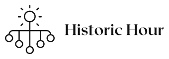

  

## 📖 Description 
This is a program for C++, made for the school project - "Linked Lists". This is an app that registers and manages historical events, made with the help of linked lists.

## 💻 Built Using 
- [Visual Studio](https://visualstudio.microsoft.com/) - Application
- [Word](https://www.microsoft.com/en-us/microsoft-365/word) - Documentation
- [PowerPoint](https://www.microsoft.com/en-us/microsoft-365/powerpoint) - Presentation
- [Excel](https://www.microsoft.com/en-us/microsoft-365/excel) - QA Documentation

## 👥 Team 
- [Yoan Gavrilov](https://github.com/YAGavrilov19) - Scrum Trainer 
- [Dimitar Dimitrov](https://github.com/DSDimitrov19) - Front-End Developer
- [Mario Berberov](https://github.com/MCBerberov19) - Back-End Developer
- [Vanina Teneva](https://github.com/Vnteneva19) - QA Engineer

